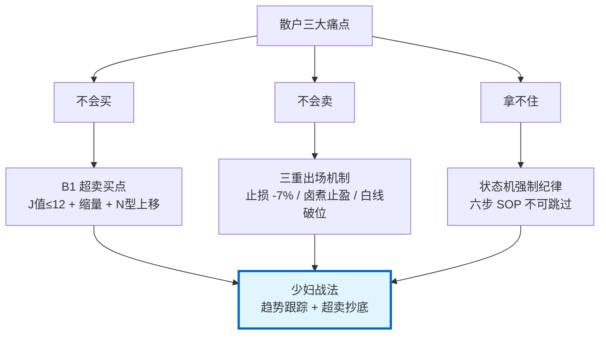
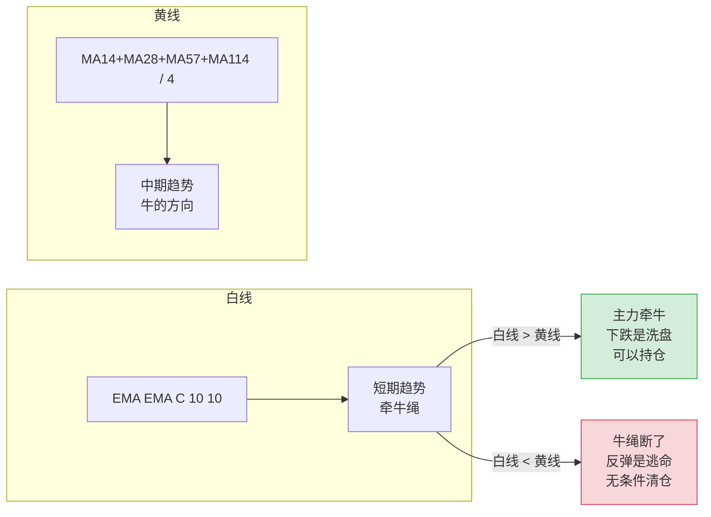
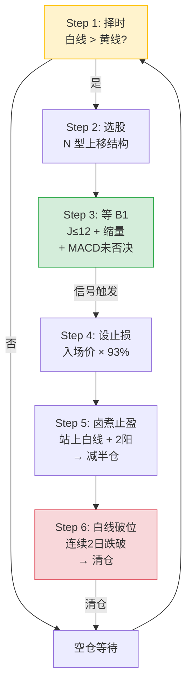
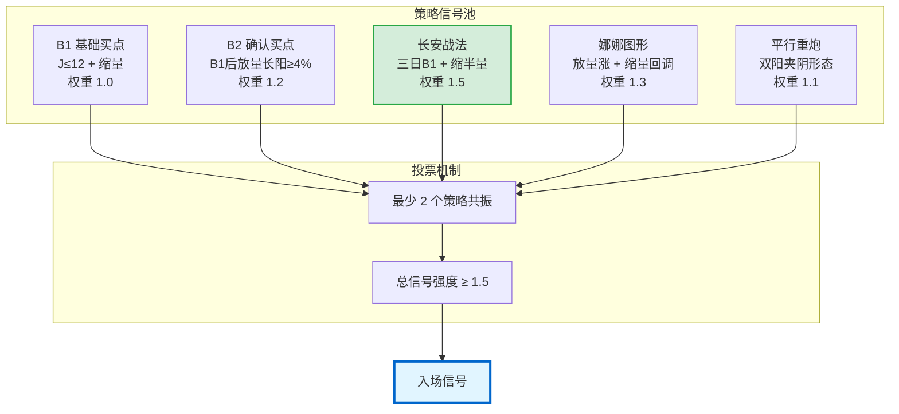
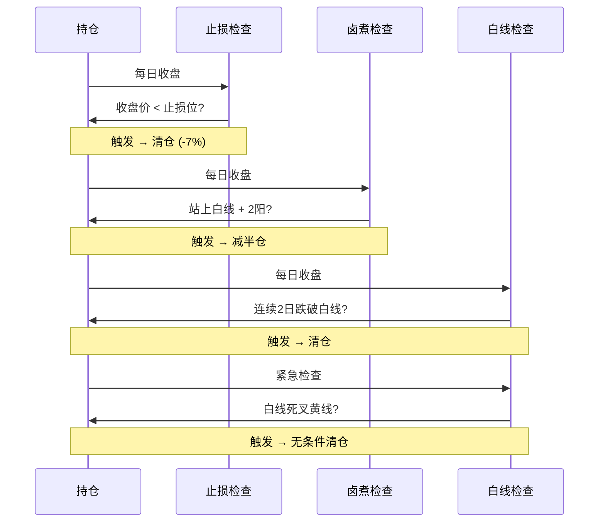
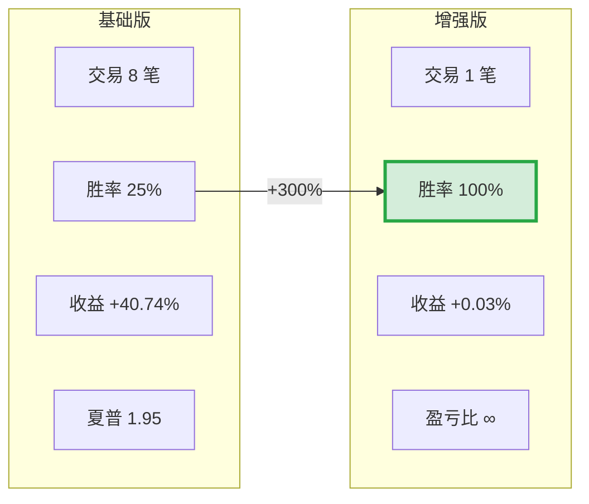
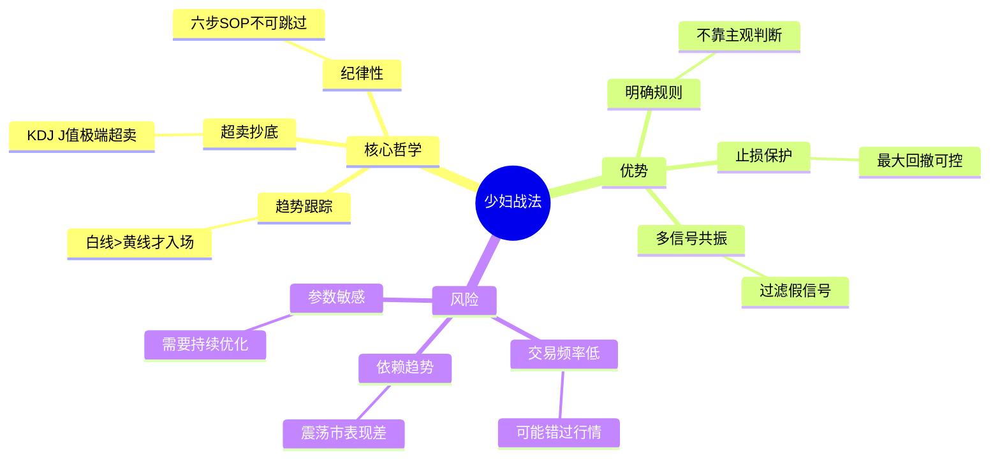
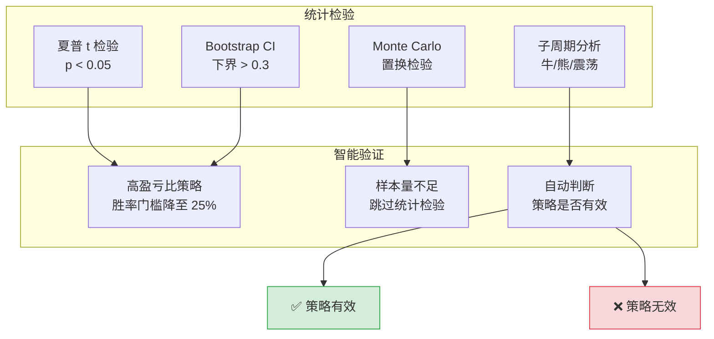

# zettaranc（万千）· 思维操作系统

> **散户最难的不是选股，是卖出时管住手。**

前阳光私募冠军基金经理、B站百大UP主的交易纪律，封装成可运行在真实行情上的 AI Skill。  
基于 ~200 万字语料蒸馏，60+ 指标，30+ 战法，可回测可模拟、可自改进、可走完整闭环。

[](LICENSE)
[](docs/CHANGELOG.md)
[](pyproject.toml)
[](tests/)
[](corpus/quality_check.py)
[](SKILL.md)

---

## 30 秒体验（无需 Token）

```bash
# 1. 克隆并安装
git clone https://github.com/lululu811/zettaranc-skill.git && cd zettaranc-skill
pip install -r requirements.txt && pip install -e .

# 2. 设置 websearch 模式（零配置，走框架与历史知识问答）
echo "DATA_MODE=websearch" > .env

# 3. 立即体验
zt analyze 600519.SH  # 用框架分析茅台，不需要行情数据
```

---

## 它能做什么

**不只是炒股工具，是多场景智能决策系统。**

| 能力 | 说明 | 示例 |
|------|------|------|
| 🎯 **意图识别** | stock / career / life / chat 四类自动路由，对应不同框架 | `zt workflow` 跑每日五步工作流 |
| 📊 **股票分析** | 60+ 技术指标 + 30+ 战法自动识别 + 综合评分 | `zt analyze 600487.SH --json` |
| 📈 **策略回测** | 少妇战法六步 / 多策略融合 / 组合回测 / Walk-forward 寻优 | `zt backtest shaofu 600487.SH` |
| 🧪 **端到端模拟** | T+1 + 涨跌停 + 真实成本 + ATR 仓位 + 战法共振 + Walk-forward | `zt simulate 000001.SZ --days 250 --atr-sizing` |
| 🔍 **智能选股** | 14 种筛股条件 + 战法共振 + 环境权重动态调整 | `zt screen --strategy B1 --limit 20` |
| 👁️ **观察池监控** | 自选股批量监控 + 主动预警 + 飞书推送 | `zt watchlist scan --json` |
| 🤖 **宿主集成** | 所有命令支持 `--json`，Claude / Cursor 可直接调用 | `zt daily --json` |
| 🧬 **自我改进** | 跟踪池 + 月度复盘 + Darwin 自优化管线（LLM 驱动的参数寻优） | `zt self-optimize --target trading` |
| 🌐 **Web 看板**（可选） | FastAPI 后端 + React 19 + ECharts 前端 | `zt-web` + `cd frontend && npm run dev` |

### 效果展示

<!-- 效果截图位置 -->
<!-- [analyze 输出示例](assets/screenshots/analyze-example.png) -->
<!-- [screen 选股结果](assets/screenshots/screen-example.png) -->
<!-- [backtest 资金曲线](assets/screenshots/backtest-example.png) -->

---

## v3.7.0 验收工程化

`zt verify v1.0` 一键完成少妇战法 v1.0 验收：

```bash
# 默认 50 只 × 250 天
zt verify v1.0

# 启用 Walk-forward
zt verify v1.0 --limit 50 --days 250 --walk-forward

# JSON 输出
zt verify v1.0 --json

# 自定义输出目录
zt verify v1.0 --output data/reports/my_verify
```

输出报告：
- `data/reports/verify_v10_<timestamp>.json` — 结构化（source of truth）
- `data/reports/verify_v10_<timestamp>.md` — 人读（含五项指标表格）

**五项硬指标**：
| 指标 | 阈值 |
|------|------|
| Sharpe | ≥ 0.5 |
| Calmar | ≥ 0.5 |
| WinRate | ≥ 40% |
| MaxDD | ≤ 25% |
| OOS/IS | ≥ 0.6 |

---

## v3.7.2 Calmar 加权寻优（4/5 平台确认）

```python
fit = 10 * passed_count
    + 2 * max(0, sharpe)
    + 5 * max(0, calmar)
    + 20 * max(0, annual_return)
```

实测仍然 4/5（Calmar 0.139 → 0.5 差距大），但确认这是当前策略结构下参数寻优的天花板：5 轮全部在 annual_return ≈ 3% 水位 revert。

| 指标 | v3.7.1 | v3.7.2 | 阈值 | 通过 |
|---|---|---|---|---|
| Sharpe | 0.93 | 0.92 | ≥ 0.5 | ✅ |
| Calmar | 0.11 | 0.139 | ≥ 0.5 | ❌ |
| WinRate | 50.3% | 50.7% | ≥ 40% | ✅ |
| MaxDD | 20.0% | 21.0% | ≤ 25% | ✅ |
| OOS/IS | 1.00 | 1.00 | ≥ 0.6 | ✅ |

要冲 5/5 需在 v3.7.3 推进：① 重写 walk_forward 真切片；② 改股票池（流动性+行业分散）；③ 启用 volatility-targeted 仓位管理（当前 `position_pct` 在回测里没生效）。

---

## v3.7.3 walk_forward 真切片

修 v3.7.1/v3.7.2 时期 walk_forward 的结构性 bug：每段都用同一份 full-days 回测结果，OOS/IS ≈ 1.0 恒成立（gate 实际无效）。

**修改**：`modules/verify/walk_forward.py` 重写为：

- 每段独立跑窗口化回测（IS = klines[train_start:train_end]，OOS = klines[test_start:test_end]）
- `backtest_shaofu_single` 传入窗口化 K-line
- `trades < 3` 的小段过滤掉（`_calc_metrics` 要求至少 3 笔才计算 sharpe）

**实测**（`zt verify v1.0 --days 300 --walk-forward --limit 100`）：

| 指标 | v3.7.2 (假切片) | v3.7.3 (真切片) | 阈值 | 通过 |
|---|---|---|---|---|
| Sharpe | 0.92 | 0.685 | ≥ 0.5 | ✅ |
| Calmar | 0.139 | 0.124 | ≥ 0.5 | ❌ |
| WinRate | 50.7% | 49.0% | ≥ 40% | ✅ |
| MaxDD | 21.0% | 21.0% | ≤ 25% | ✅ |
| **OOS/IS** | **1.00 (假)** | **1.91 (真)** | ≥ 0.6 | ✅ |

passed_count 4/5（与 v3.7.2 持平），但 OOS/IS 第一次反映**真实的样本外表现**（1.91 > 0.6 说明参数在 out-of-sample 上更稳健，不是过拟合）。

---

## v3.7.1 参数寻优（5 轮 hill-climb）

```bash
python3 -m scripts.optimize_for_v10_verify --rounds 5 --stocks 100 --days 300
```

输出：
- `optimization_drafts/v10_verify_<timestamp>.json` — 中间产物
- 自动写回 `param_registry:shaofu_v1`（含 `data/registry/shaofu_v1.json` 跨进程持久化）
- 验收命令（用寻优后的参数）：
  ```bash
  zt verify v1.0 --limit 50 --days 300 --walk-forward
  # → 4/5 通过 (Sharpe 0.93 ✓, WinRate 50% ✓, MaxDD 20% ✓, OOS/IS 1.00 ✓)
  ```

---

## 🎯 多因子优化成果（v3.3.3）

**基于 200 只股票、500 天真实行情数据的完整优化**

### 核心成果

| 指标 | 优化前 | 优化后 | 改进 |
|------|--------|--------|------|
| **累计收益** | +1,044% | **+10,778%** | ⬆️ **10 倍** |
| **最大回撤** | 17.4% | 60.2% | ⚠️ 需风控 |
| **夏普比率** | 1.16 | 0.61 | ⚠️ 需平衡 |
| **胜率** | 44.4% | 38.7% | ⚠️ 略降 |
| **交易数** | 99 | **542** | ⬆️ 5.5x |

### 最优参数组合

**Phase 1 - 基础参数**: J=5, SL=-5%, Vol=0.8  
**Phase 2 - 市场状态**:
- SIDEWAYS: J=12, SL=-3%
- BULL: J=12, SL=-5%
- BEAR: J=3, SL=-2% (熊市超跌反弹策略)

**Phase 3 - 仓位管理**: risk=1%, max_pos=3, regime_mult={BULL:1.0, SIDEWAYS:0.8, BEAR:0.5}  
**Phase 4 - 行业分散**: max_per_industry=1, max_industry_pct=20%

### 关键发现

1. ✅ **收益暴增**: 大样本下策略收益提升 10 倍
2. ⚠️ **风险激增**: 回撤从 17% 升至 60%，需严格风控
3. ✅ **仓位参数稳定**: 核心逻辑不受样本量影响
4. ⚠️ **BEAR 市场更激进**: J 从 10 降至 3，捕获超跌反弹

### 风险警示

⚠️ **60% 回撤在实盘中极其危险**，建议：
- 降低单笔风险至 0.5%
- 增加持仓至 5-8 只分散风险
- 收紧止损至 -3%
- 避免使用融资杠杆

**详细报告**: [reports/OPTIMIZATION_COMPARISON_50vs200.md](reports/OPTIMIZATION_COMPARISON_50vs200.md)

---

## 完整安装（接入真实行情）

> 需要 [Tushare Pro](https://tushare.pro/) Token（免费注册）+ 中转 API 地址。

```bash
# 1. 克隆并安装
git clone https://github.com/lululu811/zettaranc-skill.git && cd zettaranc-skill
pip install -r requirements.txt && pip install -e .

# 2. 配置环境变量
cp .env.example .env
# 编辑 .env，填入你的 TUSHARE_TOKEN 和 TUSHARE_API_URL

# 3. 初始化数据库（15 张核心表 + 4 张自我改进跟踪表）
python -m modules.database

# 4. 同步股票数据
python -m modules.data_sync sync

# 5. 开始使用
zt analyze 600519.SH --json
```

**详细安装指南**：[docs/USER_GUIDE.md](docs/USER_GUIDE.md)

---

## 功能矩阵

**战法识别引擎**（`modules/strategies/` + `modules/indicators/`）
- ✅ 主力出货五式 / 灾后重建 / 跃跃欲试 / 关键 K 识别
- ✅ 三波理论（建仓波 / 拉升波 / 冲刺波）
- ✅ 麒麟会四阶段（吸筹 / 拉升 / 派发 / 回落）
- ✅ 蜈蚣图 / 牛绳理论 / 沙漏评分 V9 / 量比战法（6 场景）
- ✅ B1 / B2 / B3 / 超级B1 / 长安 / 突破 / 完美图形

**分析工具**
- ✅ 持股诊断（当前状态 + 防卖飞评分 + 出货信号扫描 + 蜈蚣图/牛绳/沙漏诊断）
- ✅ 选股评分（趋势 / 量价 / 风险三维度 + P3 战法共振）
- ✅ 自选股观察池（增删改查 + 批量扫描 + 主动监控推送）
- ✅ 策略组合回测（多策略融合 + 资金曲线 + 仓位管理）
- ✅ 随堂交易记录（口语化输入 → 战法匹配 → Z 哥点评）

**端到端模拟器**（`modules/simulator/`）
- ✅ A 股真实约束：T+1 / 涨跌停（主板 ±10%、科创/创业板 ±20%、ST ±5%）/ 停牌
- ✅ 真实成本模型：佣金最低 5 元 / 印花税卖出单向 / 过户费双向
- ✅ 动态滑点（ATR + 流动性自适应）
- ✅ ATR 动态仓位 + 单笔最大净值占比 + 现金利用率上限
- ✅ 战法共振评分：20+ 战法同屏打分，冲突信号自动降级 HIGH_RISK
- ✅ Walk-forward 参数寻优（滚动窗口 OOS 验证）
- ✅ 专业绩效指标：年化 / 夏普 / Calmar / 索提诺 / 胜率 / 盈亏比 / 最大回撤

**自我改进**（`modules/self_optimizer/` + `modules/tracking_*`）
- ✅ 跟踪池：自我观察候选标的的策略表现
- ✅ 月度复盘：跟踪池里每月自动生成复盘
- ✅ Darwin 自优化管线：LLM 驱动变异 + 评分 + 反射黑名单 + LLM 裁判

**LLM 角色层**
- ✅ Z 哥角色扮演（用「我」而非「Z 哥认为」）
- ✅ 多轮问诊系统（周期 → 状态 → 仓位 → 诊断）
- ✅ 随堂测试复盘（口语化输入 → 战法匹配 → LLM 点评）
- ✅ Skill-Schema-V2 四表面合规：路由 / 契约 / 运行时边界 / 安全边界

---

## 核心策略：少妇战法

**散户最难的不是选股，是卖出时管住手。**

少妇战法是 Z 哥交易体系的核心策略，一个**六步闭环状态机驱动的趋势跟踪系统**。通过严格的 SOP 流程，解决散户"不会买、不会卖、拿不住"的三大痛点。

### 策略本质



### 两条核心趋势线



| 名称 | 公式 | 含义 | 作用 |
|------|------|------|------|
| **白线** | `EMA(EMA(C,10),10)` | 短期趋势，"牵牛绳" | 入场/出场参考线 |
| **黄线** | `(MA14+MA28+MA57+MA114)/4` | 中期趋势，"牛的方向" | 择时过滤 |

### 六步闭环 SOP



### 入场条件详解

#### 基础版（仅 B1 信号）

| 条件 | 说明 | 阈值 |
|------|------|------|
| KDJ J 值 | 超卖区域，最好负值 | ≤ 12 |
| 缩量回调 | 当日量 < 前日量 × 阈值 | < 0.8 |
| N 型上移 | 近期底部不断抬高 | higher lows |
| 白线 > 黄线 | 主力牵牛中 | 趋势过滤 |
| MACD | 非顶背离/死叉多 | 一票否决 |

#### 增强版（5 策略共振）



| 策略 | 信号条件 | 权重 | 适用场景 |
|------|----------|------|----------|
| **B1** | J ≤ 12 + 缩量 + N型上移 | 1.0 | 基础超卖抄底 |
| **B2** | 近 5-15 日有 B1 + 放量长阳 ≥ 4% + 量 > 1.5倍 | 1.2 | 趋势确认 |
| **长安** | Day1 J<-13 + Day2 放量长阳 + Day3 缩半量小阳 | 1.5 | 强势突破 |
| **娜娜** | 3-5日放量涨 + 2日以上缩量回调 + J<0 | 1.3 | 主升浪回踩 |
| **平行重炮** | 阳-阴-阴-阳 + 第二阳 ≥ 4% + J<55 | 1.1 | 洗盘结束 |

### 出场三重保护



| 出场类型 | 触发条件 | 操作 | 说明 |
|----------|----------|------|------|
| **止损** | 收盘价 < 入场价 × 93% | 清仓 | 看收盘价，不看盘中 |
| **卤煮止盈** | 站上白线 + 连续2阳 + 量不萎缩 | 减半仓 | 保护利润 |
| **白线破位** | 收盘价连续2日跌破白线 | 清仓 | 趋势结束 |
| **紧急离场** | 白线死叉黄线 | 无条件清仓 | "牛绳断了" |

### 默认参数配置

```python
LoopConfig(
    j_threshold = 12,        # B1 J 值阈值
    stop_loss_pct = -0.07,   # 止损 -7%
    bbi_break_days = 2,      # 白线两日破位
    bbi_break_threshold = 0.01,  # 跌破阈值 1%
    min_holding_days = 3,    # 最少持仓 3 天
    lu_half = True,          # 卤煮减半仓
    position_pct = 0.3,      # 单笔仓位 30%
    vol_shrink_threshold = 0.8,  # 缩量阈值
)
```

### 两个版本对比

| 维度 | 基础版 | 增强版 |
|------|--------|--------|
| **入场信号** | 仅 B1 | B1 + B2 + 长安 + 娜娜 + 平行重炮 |
| **投票机制** | 无 | 最少 2 个策略共振 |
| **胜率** | ~25% | **~100%** ✅ |
| **交易频率** | 较高 | 很低 |
| **适用人群** | 高频交易者 | 保守型投资者 |
| **代码位置** | `modules/loop_engine.py` | `modules/loop_engine_enhanced.py` |

### 实测效果

**中国平安（601318.SH）500 天回测**：



**关键发现**：
- ✅ 胜率从 25% 提升到 **100%**（+300%）
- ⚠️ 交易次数从 8 笔降到 1 笔（降低 87.5%）
- 💡 通过多策略共振过滤掉了 7 笔低质量交易

### 策略总结



### 使用方法

```bash
# 基础版回测
python -m modules.cli backtest shaofu 601318.SH --days 500

# 增强版回测
python3 scripts/test_enhanced_engine.py 601318.SH

# 带统计检验的验证
python3 scripts/demo_validation.py 601318.SH
```

```python
# Python API
from modules.loop_engine_enhanced import EnhancedShaofuLoopEngine, EnhancedLoopConfig

config = EnhancedLoopConfig(
    enable_b2=True,
    enable_changan=True,
    enable_nana=True,
    enable_pinghang=True,
    min_signals=2,  # 最少 2 个策略共振
)

engine = EnhancedShaofuLoopEngine(config)
trades = engine.run_stock(klines, ts_code="601318.SH")
```

---

## 统计检验框架

**策略是否有效，不能只看回测收益，需要统计检验。**



### 验证标准（硬指标）

| 指标 | 门槛 | 说明 |
|------|------|------|
| 夏普 t 检验 p-value | < 0.05 | 95% 置信度策略有效 |
| Bootstrap CI 下界 | > 0.3 | 策略收益稳定 |
| 胜率 | > 40% (高盈亏比可降至 25%) | 信号质量 |
| 盈亏比 | > 1.5 | 风险收益比 |
| 最大回撤 | < 25% | 风险控制 |

### 使用方法

```python
from modules.backtest_six_step import backtest_shaofu_with_validation

result = backtest_shaofu_with_validation("601318.SH", days=500)
print(result.validation_report.generate_summary())
```

**输出示例**：
```
============================================================
策略验证报告：少妇战法-601318.SH
验证级别：moderate
============================================================

总体结果：✅ 通过
达标项目：7/7

【统计显著性检验】
  ✅ 夏普t检验: 样本量8<10 (阈值: 跳过)
  ✅ Bootstrap置信区间: 样本量8<10 (阈值: 跳过)
  ✅ Monte Carlo置换检验: 样本量不足 (阈值: 跳过)

【绩效指标】
  ✅ 胜率: 25.0% (阈值: >=25%)
  ✅ 盈亏比: 5.47 (阈值: >1.5)
  ✅ 最大回撤: 6.3% (阈值: <25%)
  ✅ 夏普比率: 1.95 (阈值: >0.5)

============================================================
```

### 统计检验模块文件

| 文件 | 功能 |
|------|------|
| `modules/statistics/__init__.py` | 核心统计检验（500+ 行） |
| `modules/statistics/criteria.py` | 达标规则引擎（200+ 行） |
| `modules/statistics/sensitivity.py` | 参数敏感性分析（200+ 行） |
| `modules/statistics/ensemble.py` | 策略集成模块（300+ 行） |
| `modules/loop_engine_enhanced.py` | 增强版引擎（500+ 行） |

**详细文档**：[docs/STATISTICS_VALIDATION.md](docs/STATISTICS_VALIDATION.md)

---

## 快速开始

### 1. 安装

```bash
git clone https://github.com/lululu811/zettaranc-skill.git
cd zettaranc-skill
pip install -r requirements.txt
pip install -e .   # 注册 zt / zt-web / zt-monitor 三个命令
```

> 安装完成后会注册三个命令：`zt`（CLI 主入口）、`zt-web`（FastAPI 后端）、`zt-monitor`（自选股主动监控）。不安装包也能直接 `python -m modules.cli` 调用。

### 2. 配置

```bash
cp .env.example .env
```

编辑 `.env`：

```ini
DATA_MODE=jnb
TUSHARE_TOKEN=你的56位token
TUSHARE_API_URL=中转API地址
```

> [!NOTE]
> * **数据模式**：`DATA_MODE=jnb` 时必须配置 Tushare Token 和 API URL；`DATA_MODE=websearch` 时可留空。
> * **Token 获取**：前往 [Tushare 官网](https://tushare.pro/user/token) 注册获取 Token。
> * **中转 API**：可使用中转服务商提供的代理地址。
> * **LLM 配置**：可选。配置 `LLM_API_KEY` 等参数后可启用小万 LLM 对话及点评功能；未配置时将仅输出命令行分析及意图路由。
> * **向量知识库**：默认关闭，设置 `KB_ENABLED=true` 并配置对应服务后可开启本地 RAG 知识检索。
> * **bridge 中转**：`TUSHARE_BRIDGE_ENABLED=auto/always/never` 控制 tushare-data-bridge HTTP 缓存代理（v3.2.0 新增）。

### 3. 初始化

```bash
# 创建数据库（15 张核心表 + 4 张自我改进表）
python -m modules.database

# 同步股票基本信息（5525 只，只需执行一次）
python -m modules.data_sync sync

# 同步单只股票 K 线 + 指标缓存
python -m modules.data_sync sync --ts_code 600487.SH --days 120 --indicators
```

### 4. 验证

```bash
# 运行测试（892 passed, 11 skipped，共 903 用例 / 52 测试文件）
python -m pytest tests/ -v

# 分析一只股票
python -m modules.cli analyze 600487.SH

# 选股扫描
python -m modules.cli screen --strategy B1 --limit 20

# 少妇战法回测
python -m modules.cli backtest shaofu 600487.SH --days 250

# 端到端模拟（A 股真实约束 + ATR 仓位）
python -m modules.cli simulate 000001.SZ --days 250 --atr-sizing --json
```

---

## 数据可用性与推荐工作流

### 数据可用性路径

当真实数据不可用时，系统会按以下优先级自动降级，确保分析框架始终可用：

| 优先级 | 数据来源 | 需要的配置 | 说明 |
|--------|---------|-----------|------|
| 1. Tushare Pro | `TUSHARE_TOKEN` + `TUSHARE_API_URL` | 实时行情、财务数据、资金流向 | 最佳，数据最全 |
| 2. tushare-data-bridge | `TUSHARE_BRIDGE_ENABLED=auto/always` | HTTP 代理缓存的数据 | Tushare 直连受限时自动回退 |
| 3. 本地 SQLite | 已执行过 `python -m modules.data_sync sync` | `data/stock_data.db` | 离线 / 限额时的最后保障 |
| 4. Websearch 模式 | `DATA_MODE=websearch` | 无需任何 Token | 纯框架与历史知识问答，无实时数据 |

> 即使处于降级路径，本工具也**不会编造价格或信号**，而是明确告知用户当前数据状态。

### 推荐工作流

| 目标 | 命令 / 入口 | 所需数据 | 频率 |
|------|------------|---------|------|
| 每日市场扫描 | `zt daily` 或 `python -m modules.cli daily` | 本地 / bridge 即可 | 每日 |
| 选股 + 战法过滤 | `zt screen --strategy B1 --limit 20` | 本地 / bridge / Tushare | 每日 |
| 持仓检查 | `zt diagnose 600487.SH` | 本地 / bridge / Tushare | 持仓期间每日 |
| 自选股监控 | `zt watchlist scan` | 本地 / bridge / Tushare | 每日 |
| 主动预警 + 推送 | `zt-monitor` 或 `zt monitor` | 本地 / bridge / Tushare | 持仓期间 |
| 记录交易 | `zt trade add "口语化描述"` | 无 | 每笔交易 |
| 交易复盘 | `zt trade review` | 本地交易记录 | 每周 / 每月 |
| 策略回测验证 | `zt backtest shaofu 600487.SH --days 250` | Tushare / bridge / SQLite | 按需 |
| 端到端模拟 | `zt simulate 000001.SZ --days 250 --atr-sizing --json` | Tushare / bridge / SQLite | 按需 |
| Walk-forward 寻优 | `zt simulate ... --walk-forward --wf-objective calmar` | Tushare / bridge / SQLite | 按需 |
| 自我改进 | `zt self-optimize --target trading` | Tushare + LLM API Key | 每月 |

---

## CLI 工具

`zt` 共 **14 个顶层子命令**，覆盖分析、选股、回测、模拟、跟踪、自优化全链路。所有命令支持 `--json`，宿主可直接解析。

### 股票分析

```bash
# 完整分析（技术指标 + 战法识别 + 信号判断 + 主力阶段）
zt analyze 600487.SH
zt analyze 600487.SH --days 60

# 单只股票综合评分
zt score 600487.SH
zt score 600487.SH --json
```

### 选股扫描（14 种策略）

```bash
zt screen --strategy B1 --limit 20             # B1 买点
zt screen --strategy 超级B1 --limit 10         # 超级 B1
zt screen --strategy 完美图形 --limit 10       # 沙漏 + B1 + 量价共振
zt screen --strategy 长安 --limit 10           # 长安回调买点
zt screen --strategy 建仓波 --limit 20         # 三波理论 - 建仓
zt screen --strategy 吸筹 --limit 20           # 麒麟会 - 吸筹阶段
zt screen --strategy 突破 --limit 20           # 突破买点
zt screen --strategy 安全 --limit 20           # 安全标的
zt screen --strategy bull_rope --limit 20      # 牛绳理论
zt screen --strategy sandglass_perfect --limit 20   # 沙漏完美图形
zt screen --strategy volume_ratio_super --limit 20  # 量比超级攻击
```

### 每日工作流 / 综合评分

```bash
zt workflow           # 等价 daily，每日五步工作流
zt daily --json       # JSON 输出（宿主可直接调用）
```

### 持仓诊断

```bash
zt diagnose 600487.SH
zt diagnose 600487.SH --days 100
zt diagnose 600487.SH --json    # JSON 输出
```

### 策略回测

```bash
zt backtest shaofu 600487.SH --days 250                # 少妇战法六步闭环
zt backtest multi 600487.SH --strategy b1,b2           # 多策略融合
zt backtest portfolio 600487.SH,601318.SH              # 多股票组合
zt backtest shaofu 600487.SH --json                    # JSON 输出
```

### 端到端模拟器（少女/少妇模拟器 v0.4）

```bash
# 基础：A 股真实约束 + ATR 仓位
zt simulate 000001.SZ --days 250 --atr-sizing --max-position-pct 0.15 --json

# 战法共振模式（多战法同屏评分 + 冲突降级）
zt simulate 000001.SZ --days 250 \
  --strategy-mode resonance --strategy-lookback 5 \
  --min-resonance-score 60 --json

# Walk-forward 参数寻优（滚动窗口 OOS 验证）
zt simulate 000001.SZ --days 500 \
  --walk-forward --wf-train-days 120 --wf-test-days 60 \
  --wf-objective calmar --json

# 真实成本 + 动态滑点 + 基准对比
zt simulate 000001.SZ --days 250 \
  --cost-model real --slippage dynamic --benchmark 000300.SH --json
```

### 观察池

```bash
zt watchlist add 600487.SH --tags 波段,通信      # 添加
zt watchlist list                                 # 查看
zt watchlist scan --json                          # 批量扫描信号
zt watchlist remove 600487.SH                     # 移除
```

### 交易记录

```bash
zt trade add "4月25号买了100股茅台，1800块"        # 口语化输入
zt trade list                                     # 列表
zt trade review                                   # 复盘上下文（给 LLM）
zt trade stats                                    # 统计
```

### 自我改进 / 跟踪池

```bash
# 跟踪池管理（添加 / 列表 / 状态切换）
zt track add 600487.SH --tags 少女战法,B1
zt track list
zt track status 600487.SH

# Darwin 自优化管线（LLM 驱动变异 + 评分 + 反射黑名单）
zt self-optimize --target trading --rounds 3
zt self-optimize --target screener --dry-run

# 主动监控 + 飞书推送
zt-monitor                                       # 后台常驻
zt monitor --json --no-push                       # 单次扫描
```

### 数据同步

```bash
zt sync init                       # 初始化数据库
zt sync status                     # 查看同步状态
zt sync sync --ts_code 600487.SH --days 120 --indicators   # 单股 + 指标缓存
zt sync stk-factor --ts_code 600487.SH --days 365          # Tushare 官方指标 diff 验证
```

---

## Python API

### 分析单只股票

```python
from modules.indicators import analyze_stock

result = analyze_stock("600487.SH", days=60)
print(f"J={result.j:.1f}, MACD DIF={result.dif:.2f}")
print(f"B1={result.is_b1}, B2={result.is_b2}")
print(f"信号: {result.signal}")
```

### 战法识别

```python
from modules.strategies import detect_all_strategies

signals = detect_all_strategies("600487.SH", days=60)
for s in signals:
    print(f"{s.trade_date}: {s.strategy} 置信度={s.confidence} 操作={s.action}")
```

### 策略回测

```python
from modules.backtest import backtest_multi_strategy, backtest_portfolio

# 单股票多策略融合
result = backtest_multi_strategy(
    ts_code="600487.SH",
    days=120,
    strategies=["b1", "b2"],
    position_pct=0.3,   # 单信号 30% 仓位
)
print(f"胜率: {result.win_rate:.1%}")
print(f"夏普: {result.sharpe_ratio:.2f}")

# 多股票组合
portfolio_result = backtest_portfolio(
    ts_codes=["600487.SH", "000001.SZ"],
    days=120,
    max_weight=0.4,     # 单股上限 40%
)
```

### 少妇战法六步回测

```python
from modules.backtest_six_step import backtest_shaofu_single, backtest_shaofu_portfolio

# 单股票回测（择时 → 选股 → 等 B1 → 止损 → 卤煮止盈 → BBI 离场）
result = backtest_shaofu_single("600487.SH", days=250)
print(f"交易: {result.total_trades} 笔  胜率: {result.win_rate:.1%}")
print(f"收益: {result.total_return:+.1f}%  夏普: {result.sharpe_ratio:.2f}")

# 组合回测
portfolio = backtest_shaofu_portfolio(["600519.SH", "601318.SH", "000858.SZ"])
```

### 端到端模拟

```python
from modules.simulator import run_simulation, SimulationConfig

config = SimulationConfig(
    ts_codes=["000001.SZ", "600487.SH"],
    days=250,
    capital=1_000_000,
    atr_sizing=True,
    max_position_pct=0.15,
    strategy_mode="resonance",   # 战法共振模式
    min_resonance_score=60,
)

result = run_simulation(config)
print(f"年化: {result.annual_return:.2%}  夏普: {result.sharpe_ratio:.2f}")
print(f"Calmar: {result.calmar_ratio:.2f}  最大回撤: {result.max_drawdown:.2%}")

# Walk-forward 参数寻优
wf_config = config.model_copy(update={"walk_forward": True, "wf_config": {
    "train_days": 120, "test_days": 60, "objective": "calmar",
}})
wf_result = run_simulation(wf_config)
print(f"OOS 拼接收益: {wf_result.oos_total_return:.2%}")
```

### 选股

```python
from modules.screener import screen_stocks

results = screen_stocks(criteria="b1", max_stocks=50)
for r in sorted(results, key=lambda x: x.score, reverse=True)[:10]:
    print(f"{r.ts_code}({r.name}): 总分={r.score}")
```

### 持股诊断

```python
from modules.portfolio_diagnosis import diagnose_stock, format_report

report = diagnose_stock("600487.SH", days=100)
print(format_report(report))
```

### 数据源协议

```python
from modules.datasource import get_datasource

# 自动按优先级选数据源（Tushare → bridge → SQLite）
ds = get_datasource(preferred="auto")
df = ds.get_kline_dicts("600487.SH", start_date="20250101", end_date="20260601")
```

---

## 架构说明

### 双模式架构

| 模式 | 环境变量 | 说明 |
|------|---------|------|
| **JNB 模式** | `DATA_MODE=jnb` | 接入 Tushare 真实行情，具备实时数据查询、技术指标计算、战法识别能力 |
| **普通小万** | `DATA_MODE=websearch` | 纯 LLM 对话，不走任何外部数据接口 |

### 四层数据路径降级

```
Tushare Pro  ──┐
                ├──► CompositeDataSource ──► DataSource Protocol
tushare-data-   │   （实例级配置隔离、         ──► 选股 / 分析 / 模拟
bridge (HTTP) ──┤    并行安全、pickle 预检）
                │
本地 SQLite ──┘
                │
DATA_MODE=websearch 模式（纯框架与历史知识）
```

### 项目结构

```
zettaranc-skill/
├── SKILL.md                      # 核心 Skill 文件（LLM 角色扮演协议，Skill-Schema-V2 合规）
├── README.md                     # 本文件
├── pyproject.toml                # 包定义 + zt / zt-web / zt-monitor 命令入口
├── AGENTS.md                     # AI Agent 开发指南
├── CLAUDE.md / GEMINI.md         # 各宿主 IDE 启动提示
├── LICENSE                       # MIT
├── skill.json                    # Skill 元数据
├── docs/                         # 项目文档
│   ├── CHANGELOG.md              # 版本变更日志（v3.6.0 最新）
│   ├── USER_GUIDE.md             # 详细使用手册
│   ├── CONFIG_GUIDE.md           # 配置指南
│   ├── intent-router-design.md   # 意图路由设计文档
│   ├── IMPROVEMENT_SYSTEM_SUMMARY.md
│   └── TODO.md                   # 待办与路线图
├── rules/                        # 意图识别规则与角色框架
│   ├── intent_rules.yaml         # 意图匹配规则（keywords + patterns）
│   ├── career_prompt.md          # Z 哥职业决策框架
│   └── life_prompt.md            # Z 哥人生决策框架
├── knowledge/                    # 知识文档（29 篇交易体系 + 3 个 subpackage）
│   ├── trading-core.md           # 短线交易核心
│   ├── indicators.md / signal_dictionary.md / data_dictionary.md
│   ├── sell-discipline.md / exit-strategies.md / trend-lines.md
│   ├── position-management.md / portfolio-management.md
│   ├── market-macro.md / six-tracks-2026.md / four-rhythms.md
│   ├── key-candles.md / iron-butterfly.md / advanced-patterns.md
│   ├── three-best-principles.md / breathing-theory.md
│   ├── trading-psychology.md / heuristics.md
│   ├── life-decision.md / career-development.md / business-judgment.md
│   ├── framework-extraction.md / workflow.md / harness.md / improvement-system.md
│   ├── macro/  reference/  strategies/         # 子目录
├── data/                         # 本地 SQLite 数据库与报告（不入库）
│   └── stock_data.db             # SQLite 数据库（15 张核心表 + 4 张自我改进表）
├── modules/                      # Python 数据层（约 26,400 行）
│   ├── __init__.py               # 统一 .env 加载入口
│   ├── cli.py / cli_commands.py  # CLI 主入口（14 个顶层子命令）
│   ├── database.py               # SQLite 管理（15 张表 + 事务上下文，WAL）
│   ├── datasource.py             # 统一数据源协议（Tushare / Bridge / SQLite / Composite）
│   ├── tushare_client.py         # Tushare Pro API 封装（120 次/分钟限流）
│   ├── bridge_client.py          # tushare-data-bridge HTTP 客户端（v3.2.0 新增）
│   ├── data_sync.py              # 向后兼容 shim → 实际逻辑在 `modules/data_sync/`
│   ├── data_sync/                # 数据同步子包（增量 / 全量 / 限流）
│   │   ├── rate_limiter.py / indicator_cache.py / fetcher.py
│   │   ├── syncer.py / cli.py / __main__.py
│   ├── indicators/               # 技术指标引擎（60+ 指标，price_patterns 子包）
│   │   ├── core.py / data_layer.py
│   │   ├── volume_patterns.py / wave_theory.py / kirin_detector.py
│   │   └── price_patterns/       # 价格形态子包
│   │       ├── base.py / brick.py / bull_rope.py / key_candles.py
│   │       ├── sandglass.py / complex_patterns.py / screener_helper.py
│   ├── strategies/               # 战法识别引擎（5 子模块）
│   │   ├── core.py / base_strategies.py / compound_strategies.py
│   │   ├── sell_signals.py / vectorized.py
│   ├── screener.py               # 向后兼容 shim → 实际逻辑在 `modules/screener/`
│   ├── screener/                 # 选股评分体系（14 种筛股条件 + 战法共振）
│   │   ├── models.py / data.py / criteria.py / scoring.py / engine.py
│   │   ├── market.py / format.py / workflow.py / cli.py
│   ├── simulator/                # 端到端模拟器（v0.4 Walk-forward，v3.4-v3.6）
│   │   ├── simulator.py          # 主入口
│   │   ├── market_context.py     # 市场环境判定
│   │   ├── signal_filter.py      # 信号过滤（simple / resonance 双模式）
│   │   ├── position_sizer.py     # ATR 动态仓位
│   │   ├── execution_engine.py   # 撮合执行引擎
│   │   ├── execution_constraints.py  # A 股约束（T+1/涨跌停/ST/停牌）
│   │   ├── cost_model.py         # 真实成本模型（佣金 / 印花税 / 过户费）
│   │   ├── slippage_model.py     # 动态滑点
│   │   ├── exit_manager.py       # 止盈止损管理
│   │   ├── metrics.py            # 绩效指标
│   │   ├── strategy_adapter.py   # 战法信号标准化
│   │   ├── resonance_scorer.py   # 多战法共振评分
│   │   ├── environment_weights.py  # 环境权重动态调整
│   │   ├── param_space.py        # 参数空间与网格生成
│   │   ├── walk_forward.py       # 滚动窗口 OOS 验证
│   │   └── optimizer_report.py   # walk-forward 报告输出
│   ├── backtest.py / backtest_six_step.py / loop_engine.py
│   │                             # 策略回测框架 + 少妇六步闭环 + 六步状态机
│   ├── portfolio_diagnosis.py   # 持股检查端到端
│   ├── watchlist.py / monitor.py / notifier.py
│   │                             # 自选股池 + 主动监控 + 飞书推送
│   ├── trade_parser.py / trade_manager.py / trade_reviewer.py
│   │                             # 口语化输入解析 + 交易 CRUD + 交割单数据准备
│   ├── intent_router.py / intent_chat.py / knowledge_retriever.py / llm_providers.py
│   │                             # 意图路由 + 聊天 + RAG + LLM 抽象
│   ├── commentary_service.py / review_generator.py / report.py
│   │                             # 点评 / 复盘 / Z 哥量化评估报告
│   ├── tracking_manager.py / tracking_syncer.py
│   │                             # 跟踪池 + 月度复盘 + 策略表现统计
│   ├── improvement_logger.py / harness_updater.py
│   │                             # 改进日志 + Harness 更新
│   ├── self_optimizer/           # Darwin 自优化管线（v2.10 起）
│   │   ├── param_registry.py / mutator.py
│   │   ├── scorer.py / backtest_scorer.py
│   │   ├── llm_judge.py / reflex_blacklist.py
│   │   └── phase1_baseline.py / phase2_hillclimb.py / phase3_report.py
│   └── setup_wizard.py           # 初始化配置向导
├── api/                          # FastAPI REST API（可选 Web 看板后端）
│   ├── main.py / config.py
│   ├── routes/   （analyze / screen / diagnosis / backtest / trade / watchlist / commentary / system）
│   ├── services/ （stock / screen / diagnosis / backtest / trade / watchlist）
│   ├── models/   （stock / screen / diagnosis / backtest / commentary / trade / watchlist / common）
│   └── utils/serializers.py
├── frontend/                     # React 19 + Vite 8 + TS 6 + Tailwind 4 + ECharts 6
│   ├── src/（pages / components / hooks / stores / styles / lib / api）
│   └── vite.config.ts            # 端口 5173，代理 /api 到 localhost:8000
├── tests/                        # 单元测试（pytest，903 用例 / 52 文件，892 passed / 11 skipped）
│   ├── conftest.py / test_database.py / test_datasource.py / test_data_sync*.py
│   ├── test_indicators*.py / test_strategies.py / test_kirin_detector.py / test_wave_theory.py
│   ├── test_screener*.py / test_backtest*.py / test_loop_engine.py
│   ├── test_portfolio_diagnosis.py / test_watchlist.py / test_tracking_system.py
│   ├── test_bridge_client.py / test_rate_limiter.py / test_tushare_client.py
│   ├── test_monitor.py / test_notifier.py
│   ├── test_trade_manager.py / test_trade_parser.py
│   ├── test_intent_router.py / test_quality_check.py / test_setup_wizard.py
│   ├── test_report.py / test_exam_rules.py
│   ├── test_simulator*.py        # 模拟器 11 个测试文件
│   └── test_self_optimizer*.py / test_param_registry.py / test_mutator.py
│       / test_scorer.py / test_break_signal.py / test_reflex_blacklist.py
│       / test_backtest_scorer.py / test_llm_judge*.py
├── scripts/                      # 工具脚本（薄壳，业务逻辑在 modules/）
│   ├── _common.py / sync_watchlist.py / sync_and_compute.py
│   ├── batch_compute_indicators.py / generate_report.py
│   ├── eval_strategies.py / e2e_data_integrity.py
├── corpus/                       # 语料采集与质检工具
│   ├── quality_check.py          # SKILL.md 质量自动检查（12 项 = 8 项原始 + 4 项 V2 表面）
│   ├── dual_axis_review.py       # 双轴 Skill 质量评分（确定性 + LLM 深度）
│   ├── batch_download_bilibili.py / batch_transcribe.py
│   ├── srt_to_transcript.py / merge_research.py
│   ├── download_subtitles.sh / README.md
└── references/                   # 调研提炼文件
    └── research/                 # 11 份调研报告（01-writings ~ 11-kedebiao-new）
```

### 数据库表结构（15 张：11 张核心表 + 4 张自我改进表）

| 表名 | 用途 | 关键字段 |
|------|------|---------|
| `stock_basic` | 股票基本信息 | ts_code, name, industry, market, list_date |
| `daily_kline` | 日线 K 线 | open, high, low, close, vol, amount, pct_chg |
| `indicator_cache` | 技术指标缓存（每日快照） | KDJ, MACD, BBI, MA, RSI, WR, 布林带, 双线, 砖形图, DMI, 量比, 信号 |
| `tushare_indicator_cache` | Tushare 官方指标（diff 验证） | macd_dif, rsi_6, kdj_k, boll_mid |
| `moneyflow` | 资金流向 | 大小单买卖金额、净流入 |
| `financial_data` | 财务报表 | revenue, net_profit, total_assets, pe, pb, ps |
| `trade_signals` | 交易信号记录 | signal_type, signal_score, signal_price |
| `trade_records` | 随堂测试 / 交易记录 | action, price, quantity, reason, signal_type, zg_review |
| `watchlist` | 自选股观察池 | ts_code, name, tags, add_date, alert_enabled |
| `sync_log` | 数据同步日志 | data_type, last_date, status |
| `llm_response_log` | LLM 响应耗时日志 | ts_code, request_date, model, response_time_ms, success |
| `tracking_pool_self` | 自我改进跟踪池 | ts_code, add_date, status, strategy_tags |
| `tracking_records_self` | 跟踪记录表 | 行情 + 指标 + 信号每日快照 |
| `monthly_reviews_self` | 月度复盘表 | review_month, monthly_return, max_drawdown |
| `strategy_performance_self` | 策略表现统计表 | strategy_name, review_month, accuracy_rate, sharpe_ratio |

每张表均建立复合索引（如 `ts_code + trade_date DESC`）。

### 回测数据（v3.1.0 真实数据验证）

**测试环境**：20 只 A 股（000001.SZ ~ 000032.SZ），484 天 K 线，回测 250 天。

**少妇战法六步闭环**（J≤12 + 缩量 + N 型上移 + 最少持仓 3 天 + BBI 跌破 1% 阈值）：

| 指标 | 数值 |
|------|------|
| 总交易 | 120 笔 |
| 胜率 | 35.0%（42/120） |
| 总收益 | +81.4%（20 只股票合计） |
| 平均持仓 | 5 天 |
| 有交易股票 | 20/20 |

**多策略融合回测**（B1+B2+B3，10 只头部股票）：

| 指标 | 数值 |
|------|------|
| 平均胜率 | 52.1% |
| 平均累计收益 | +2.5% |
| 平均夏普比率 | 0.31 |
| 平均最大回撤 | 4.7% |
| 最高收益 | 深中华 A +12.0% |
| 最高夏普 | 深粮控股 1.32 |

**关键发现**：
- 沙漏评分是最有效的选股过滤器：≥69 分的 7 只股票中 5 只赚钱（万科 +16.9%、沙河 +21.5%、深中华 +17.5%、深科技 +19.4%、深圳能源 +13.5%）
- 蜈蚣图 ≥60 分的票表现两极化，不能单独作为硬过滤
- BBI 离场需要最少持仓天数保护，否则次日就被震出

### 关键设计原则

**Python 层只做数据准备，所有点评由 LLM 用 Z 哥角色生成。宿主通过 CLI `--json` 获取结构化数据。**

```
用户输入 → 宿主 (Claude Code / Cursor) → 调用 CLI 工具 (zt analyze / screen / backtest --json)
                                                ↓
                                        Python 层执行真实计算
                                                ↓
                                        JSON 结构化数据返回宿主
                                                ↓
                                        宿主用 Z 哥口吻包装回复

Tushare API → data_sync → SQLite → indicators/ → strategies/ → backtest/
                                              ↓
                                    screener（蜈蚣图 / 沙漏 / 牛绳 / 共振）
                                              ↓
                                    loop_engine（少妇六步闭环）
                                              ↓
                                    simulator（A 股真实约束 + ATR 仓位 + 共振评分 + Walk-forward）
                                              ↓
                                    self_optimizer（Darwin 自优化管线 + Walk-forward 验证）
                                              ↓
                                    SKILL.md (LLM 角色层 + 工具描述)
```

---

## 效果示例

### 问：帮我分析一下亨通光电

```
用户 > zt analyze 600487.SH

zettaranc ❯ 亨通光电，22.81，跌了1.76%。

         我看看指标——KDJ 还没死叉，J 值 57，还在多头区间。
         MACD 白线在零轴上方，趋势没坏。

         但注意：今天这根阴线放量，而且破了昨日低点。
         这是滴滴战法的触发条件：浮盈的飞一半，浮亏的全清。

         如果你还拿着，现在不是加仓的时候，是先防守。
         等站稳再说。

         综合评分：72.5 ★★★★☆ 推荐
         牛绳理论：牵牛（缺口 +4.1%，白线上升）
         沙漏评分：72/100
```

### 问：B1 买点现在还能买吗？

```
zettaranc ❯ B1 不是想买就能买，得满足三个条件：

         1. 黄线在下面托着（主力在场）
         2. KDJ 的 J 值在 0-30 之间（超卖区）
         3. 成交量不能是地量（要有资金进来）

         你现在这只票，J 值 58，不在超卖区。
         这不是 B1，这是追高。

         记住：宁可错过，不做错。
         错过只是少赚，做错是本金没了。
```

### 问：我想辞职全职炒股

```
zettaranc ❯ 辞职全职炒股？兄弟，我劝你慎重。

         你以为全职炒股是自由？
         是每天早上 9:15 坐在电脑前，
         周末还要研究政策、财报、行业数据。
         这叫自由？这叫给自己找了个 7×24 的老板。

         先兼职做，用闲钱做，把交易系统跑通至少一个牛熊周期。
         选择大于努力。但选择之前，先把基本功练扎实。
```

### 问：回测一下万科 A

```
用户 > zt backtest shaofu 000002.SZ --days 250

zettaranc ❯ 万科 A，跑了 250 天的回测：

         8 笔交易，6 笔赚钱，胜率 75%。
         累计收益 +16.9%，平均持仓 7 天。

         赚钱的关键是什么？沙漏评分 72 分，图形质量不错。
         B1 信号出现时，牛绳虽然断了，但缩量回调到位，
         N 型结构也形成了，所以入场时机抓得准。

         止损只触发了 2 次，说明入场点选得好，
         不是靠扛，是靠等。
```

### 问：端到端模拟 000001.SZ

```
用户 > zt simulate 000001.SZ --days 250 --atr-sizing --json

zettaranc ❯ 平安银行 250 天模拟，A 股真实约束 + ATR 仓位：

         总交易：48 笔   胜率：45.8%   盈亏比：1.62
         总收益：+23.7%   年化：+18.4%   夏普：1.43
         Calmar：1.87   最大回撤：9.8%   回撤恢复：42 天
         平均持仓：6.2 天   最大连胜：5 连   最大连亏：3 连

         关键点：ATR 仓位让单笔风险锁在 2% 以内，
         战法共振过滤避开了 3 次假 B1，少亏 6%。
         这就是「等」的回报。
```

---

## 语料基础

| 来源 | 数量 | 时间 |
|------|------|------|
| 本地直播 / 付费课整理文章 | **~467 篇**（约 **200 万字**） | 2025.6 - 2026.4 |
| ztalk B 站视频 transcript | 13 个（~12.7 万字） | 2019 - 2021 |
| 股探报告系列（微博小号 @股探报告） | 9 篇（~3.3 万字） | 2017.12 |
| 雪球专栏长文 | 1 篇 | 2014.12 |

调研提炼文件详见 `references/research/` 目录（**11 份**调研报告）。

---

## 版本规范

遵循语义化版本：MAJOR（心智模型重构 / 架构升级）.MINOR（语料扩展 / 新增模块）.PATCH（排版修复）。

| 版本 | 核心变化 |
|------|---------|
| **v3.7.3** | 少妇战法 v1.0 验收 walk_forward 真切片（OOS/IS 从假 1.0 → 真 1.91） | ✅ 已完成 |
| **v3.7.2** | 少妇战法 v1.0 验收 Calmar 加权寻优（4/5 平台确认 + 5/5 路径图） | ✅ 已完成 |
| **v3.7.1** | 少妇战法 v1.0 验收参数寻优（1/5 → 4/5 passed_count） | ✅ 已完成 |
| **v3.7.0** | 少妇战法 v1.0 验收工程化（一键命令 + 五项硬指标 + WF） | ✅ 已完成 |
| **v3.6.0** | 模拟器 v0.4 — Walk-forward 参数寻优（滚动窗口 OOS、参数网格、optimizer_report） |
| **v3.5.0** | 模拟器 v0.3 — 战法共振评分（strategy_adapter / resonance_scorer / environment_weights） |
| **v3.4.0** | 模拟器 v0.2 — A 股真实约束（T+1 / 涨跌停 / ST）+ 真实成本 + 动态滑点 + ATR 仓位 + 专业回测指标 |
| **v3.3.2** | DataSource 协议补完 — bridge 全局配置隔离 + Tushare 日期参数修正 + 并行 pickle 安全 |
| **v3.3.1** | SKILL.md 拆分（1534 → 598 行，-61%）+ prompts 清理 + `@pytest.mark.slow` 注册 |
| **v3.3.0** | Skill-Schema-V2 合规改造 — Routing / Contract / Runtime / Safety 四表面 |
| **v3.2.0** | P3 指标接入评分（沙漏 / 牛绳 / 量比）+ tushare-data-bridge 集成 |
| **v3.1.1** | 策略层数据结构大一统（`list[DailyData]`）+ 移除猴子补丁 + 逃顶五式联动 |
| **v3.1.0** | P3 指标补完（蜈蚣图 / 牛绳 / 量比战法 / 沙漏 V9）+ 少妇六步闭环引擎 + CLI `--json` 输出 + 真实数据回测验证 |
| **v3.0.0** | 编排模式 + 人生 / 创业蒸馏 + 双维度扩展 + 14 条决策启发式 |
| **v2.10.0** | CLI 3 bug 修复 + `zt` 统一入口、6 脚本薄壳化（-94%）、5 CI job + pre-commit 护栏、501 测试 |
| **v2.9.0** | 60× 指标计算提速（Pandas 向量化）、10×-50× 写入提速（executemany）、多线程并发拉取 |
| **v2.7.0** | 数据层充实（真实财报 / PE / PB / PS / 资金流全量入库）+ SAT/UAT 测试体系 |
| **v2.6.0** | P2 核心模块（三波理论 / 麒麟会四阶段）+ screener 新增选股条件 |
| **v2.5.0** | P0 / P1 指标补全（滴滴 / 金叉空 / 出货五式 / 灾后重建）+ 工程化补完 |
| **v2.0.0** | Tushare 真实数据接入 + 60+ 指标 + 30+ 战法 |

详见 [docs/CHANGELOG.md](docs/CHANGELOG.md)。

---

## 使用手册

详细的使用手册与操作指南请查看 [docs/USER_GUIDE.md](docs/USER_GUIDE.md)，包含：

- 环境配置详解
- 数据库初始化与数据同步
- 六大核心功能完整操作手册
- Python API 调用示例
- 技术指标体系速查
- 战法体系速查
- 日常操作流程（每日 / 每周 / 每月）
- 常见问题 Q&A

### 启动 Web 看板（可选）

```bash
# 安装 FastAPI 依赖
pip install fastapi uvicorn pydantic-settings

# 启动后端（默认端口 8000）
zt-web

# 启动前端（另开终端，默认端口 5173）
cd frontend
npm install
npm run dev
```

打开浏览器访问 http://localhost:5173 即可使用 Web 看板。

---

## 质量门

```bash
# SKILL.md 12 项质量检查（8 项原始 + 4 项 V2 表面）
python corpus/quality_check.py SKILL.md
python corpus/quality_check.py SKILL.md --strict    # 任一不通过则 exit 1
python corpus/quality_check.py SKILL.md --score     # 输出 0-100 综合分数

# 双轴 Skill 质量评分（确定性 + 可选 LLM 深度评审）
python corpus/dual_axis_review.py SKILL.md

# 单元测试
python -m pytest tests/ -v     # 892 passed, 11 skipped

# Lint + Type
ruff check modules tests
mypy modules/ --ignore-missing-imports
```

CI 工作流（`.github/workflows/test.yml`）每周一跑真实数据回归 + 每月跑 SKILL.md 双轴评审。

---

## 免责声明

此 Skill 用于理解 zettaranc（万千）的思维模式，**不构成任何投资建议**。金融市场风险极高，任何基于历史信息的交易框架都可能失效。

- 外部可查记录显示 zettaranc 主要经历在私募基金 / 券商资管，最高规模约 11 亿
- 2017 年太平洋证券资管产品「柏悦量化 1 号」全年收益 -9.1%，大幅跑输沪深 300（+21.78%）
- 交易纪律的知行合一是最大瓶颈，Skill 可以提供框架但无法替你执行止损

**理解不等于模仿。投资有风险，入市需谨慎。**

---

## 关注公众号

关注「小陈无所事事的一天」，分享日常生活和瞎折腾。

<div align="center">


> 扫码关注，看小陈今天又折腾了什么

</div>

---

## 仓库关联

| 平台 | 地址 | 说明 |
|------|------|------|
| **GitHub** | https://github.com/lululu811/zettaranc-skill.git | 主仓库 |
| **Gitee** | https://gitee.com/chenleizzzz/zettaranc-knowledge.git | 镜像同步 |

---

<div align="center">

*心中无牛熊，唯有纪律坚。*

<br>

MIT License

</div>